## Задача 7. **Prometheus** и **Grafana**

##### Установить и настроить **Prometheus** и **Grafana** на виртуальную машину.

- После того как провели настройку **Prometheus** проверим статус программы и введем команду: `sudo systemctl status grafana-server`

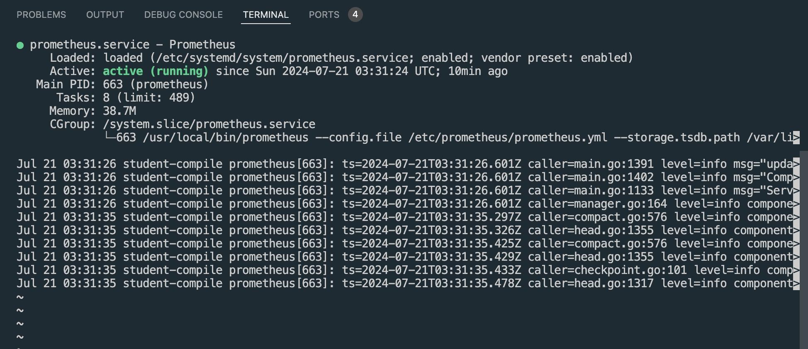

- После того как провели настройку **Grafana** проверим статус программы и введем команду: `sudo systemctl status grafana-server`

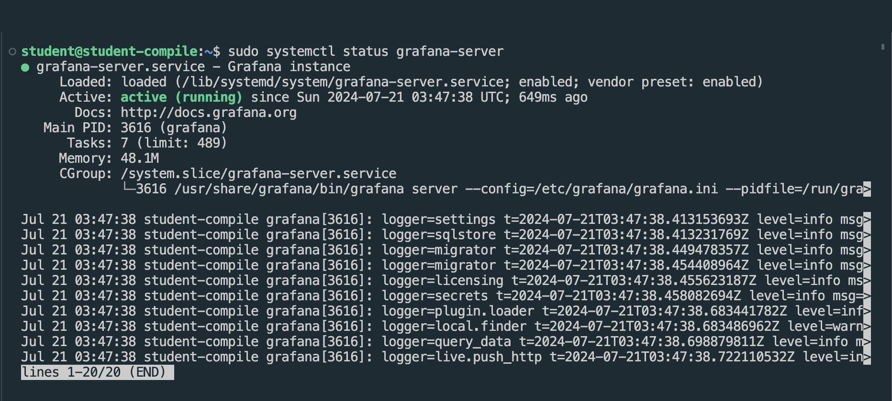

- После того как провели настройку **Node Exporter** проверим статус программы и введем команду: `systemctl status node_exporter.service`

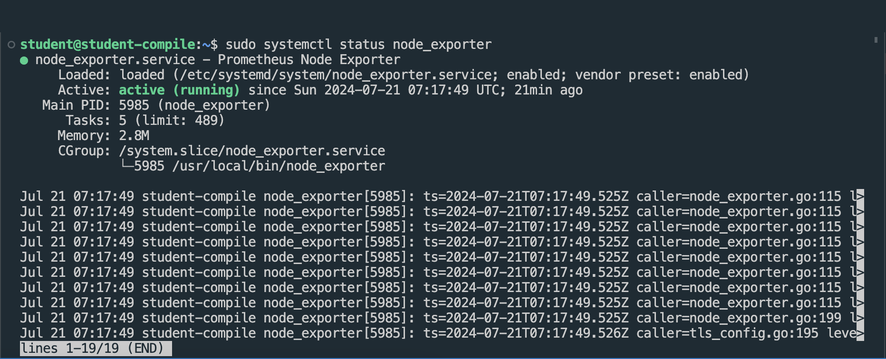

##### Получить доступ к веб-интерфейсам **Prometheus** и **Grafana** с локальной машины.

- Для **Prometheus** в браузере введём адрес: `http://localhost:9090` и получаем доступ к веб-интерфейсу **Prometheus**. В Status выберите Targets, на странице "/targets" если все хорошо, то в колонке статуса (State) будет “UP”.

- **Node Exporter** работает на порту 9100. Это понадобится при настройке дашбордов в **Grafana**

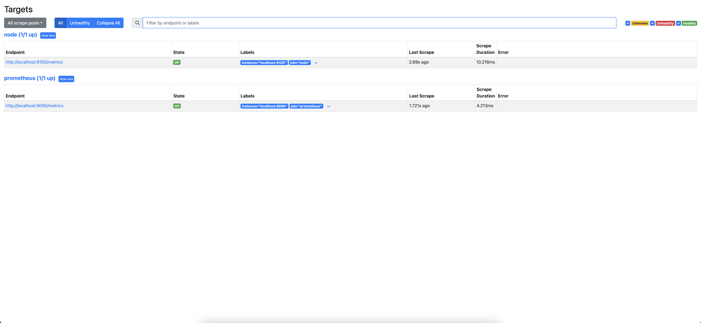

- Для **Grafana** в браузере введём адрес: `http://localhost:3000`

- Далее введем login: `admin`, password: `admin` и получаем доступ к веб-интерфейсу **Grafana**

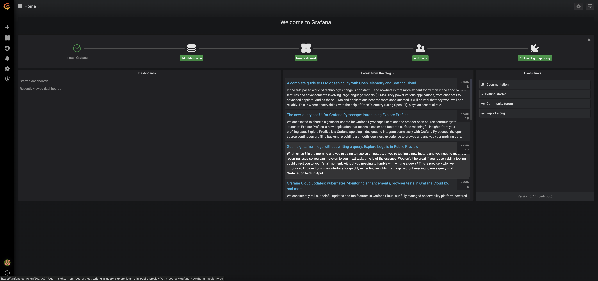

##### Добавить на дашборд **Grafana** отображение ЦПУ, доступной оперативной памяти, свободное место и кол-во операций ввода/вывода на жестком диске.

##### Кодовое представление дашбордов

- CPU: rate(node_cpu_seconds_total{job="node", instance="localhost:9100", mode!="idle"}[1m])

- Free RAM: node_memory_MemAvailable_bytes / 1024 / 1024

- Free Space: node_filesystem_avail_bytes{mountpoint="/"} /1024/1024/1024

- I\O disk: rate(node_disk_reads_completed_total{job="node", device="sda"}[1m])

- rate(node_disk_writes_completed_total{job="node", device="sda"}[1m])

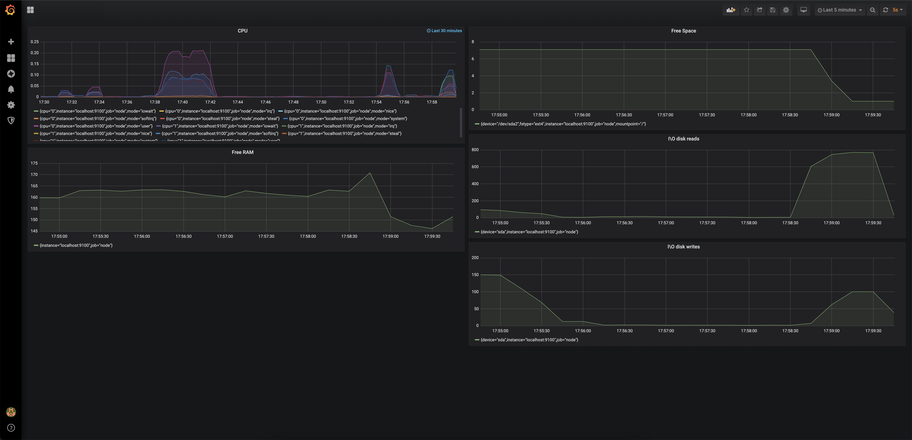

##### Запустить bash-скрипт из `Части 2`

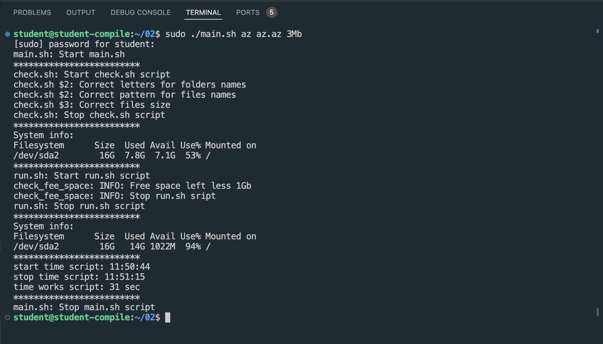

##### Посмотреть на нагрузку жесткого диска (место на диске и операции чтения/записи).

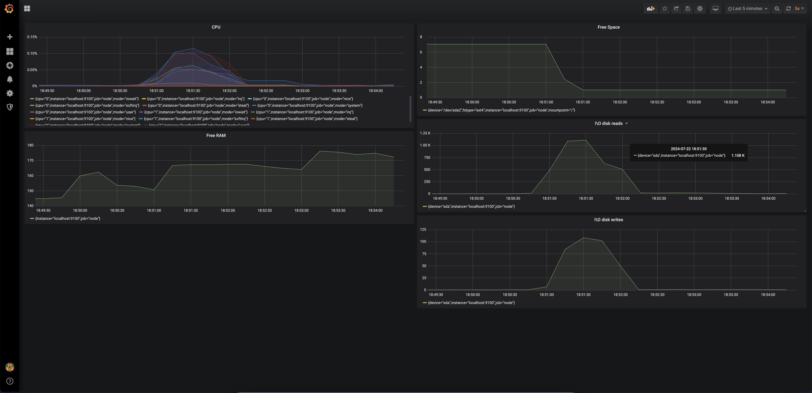

- Очистка диска

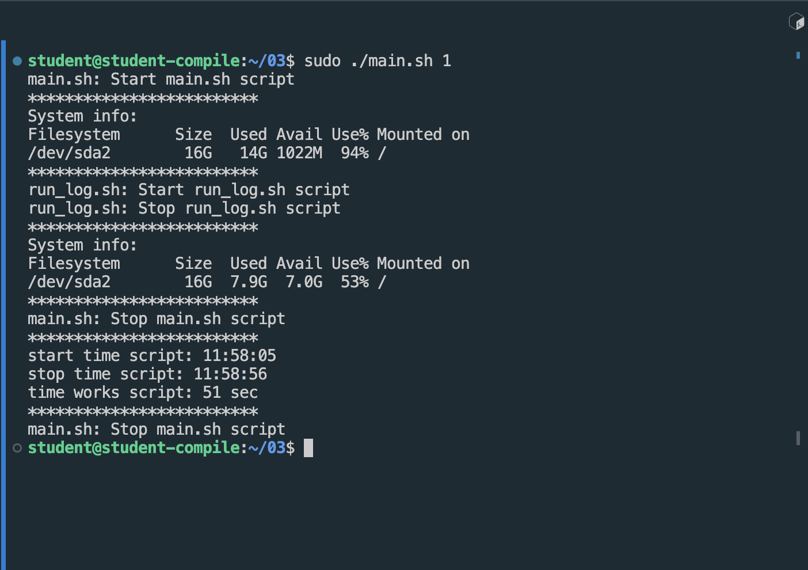

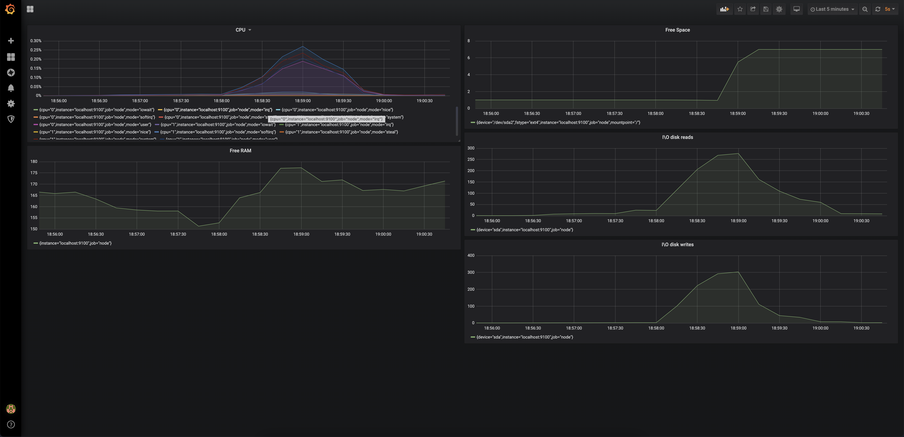

##### Установить утилиту **stress** и запусти команду `stress -c 2 -i 1 -m 1 --vm-bytes 32M -t 10s`

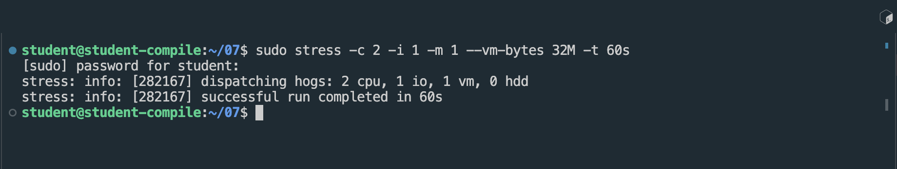

##### Посмотреть на нагрузку жесткого диска, оперативной памяти и ЦПУ.

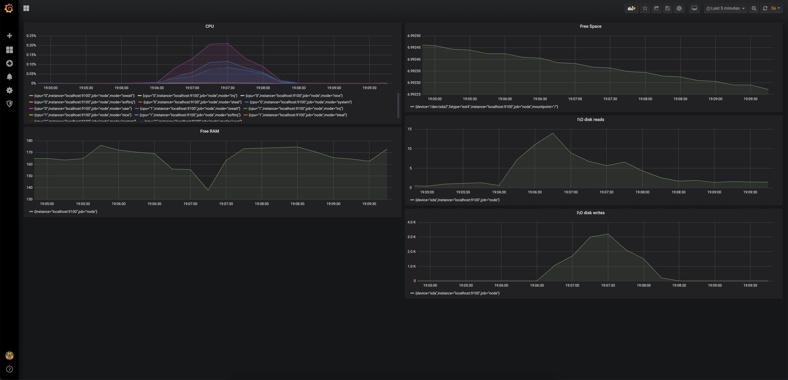
