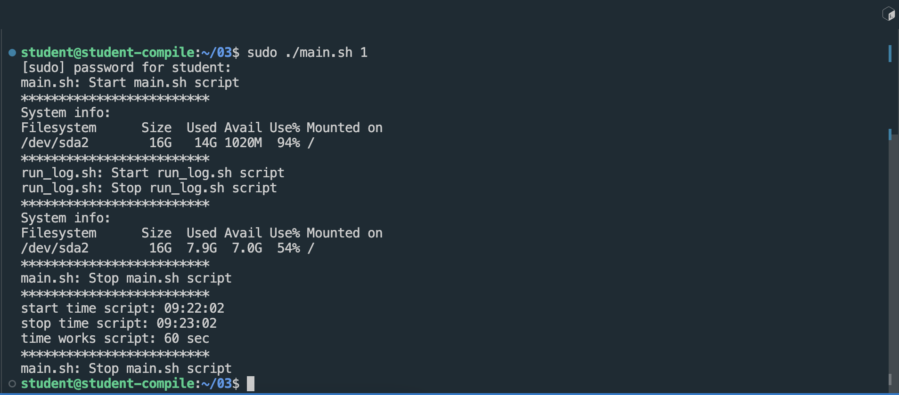

## Задача 8. Готовый дашборд

##### Установить готовый дашборд _Node Exporter Quickstart and Dashboard_ с официального сайта **Grafana Labs**.

- После регистрации на официальном сайте **Grafana Labs** находим _Node Exporter Quickstart and Dashboard_ и копируем ID dashboard или скачиваем JSON файл

- Далее заходим в **Grafana** на локальной машине, выбираем пункт Manage в Dashboards и нажимаем на кнопку `Import`

- Переходим в окно загрузки готового дашборда

- Вводим ID dashboard или загружаем JSON файл. Даем имя для данного дашборда и выбираем папку где будет данный дашборд в **Grafana** находиться. Нажимаем на кнопку `Import`

- Получаем готовый дашборд _Node Exporter Quickstart and Dashboard_

##### Провести те же тесты, что и в `Части 7`

- Запусти свой bash-скрипт из `Части 2`

- Посмотри на нагрузку жесткого диска (место на диске и операции чтения/записи)

- Очистка диска

- Используя утилиту **stress** и запустить команду `stress -c 2 -i 1 -m 1 --vm-bytes 32M -t 10s`

- Посмотреть на нагрузку жесткого диска, оперативной памяти и ЦПУ

##### Запустить ещё одну виртуальную машину, находящуюся в одной сети с текущей.

- Проверка соединения между двумя машинами

##### Запустить тест нагрузки сети с помощью утилиты **iperf3**.

- Запуск утилиты **iperf3** на сервере, IP сервера: 10.10.0.1

- Запуск утилиты **iperf3** на клиенте, IP клиента: 10.10.0.2

##### Посмотреть на нагрузку сетевого интерфейса.

